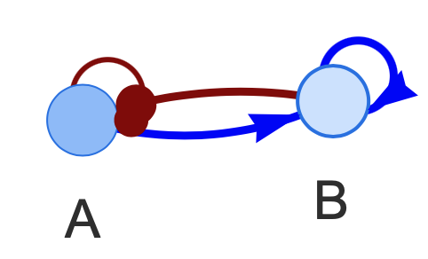

```{r setup, include=FALSE}
knitr::opts_chunk$set(echo = TRUE, warning = FALSE, message = FALSE, fig.width = 7, fig.height = 6, fig.align = "center")
```

# Introduction

Motif4node is a package that allows systematic, high-throughput, and quantitative evaluation of how small transcriptional regulatory circuit motifs, and their coupling, responsible for a particular structure of gene expression state distributions. Moitf4node utilizes an ensemble-based mathematical modeling method ([sRACIPE](https://www.bioconductor.org/packages/release/bioc/html/sRACIPE.html)) for circuit simulations. In this tutorial, we illustrate the usage of motif4node.

# Load circuit topology and perform RACIPE simulations

Motif4node includes a data set, containing the topologies of all 60212 non-redundant 4-node gene circuits. The R data file *data/all_circuits.rdata* is a list with each element being a 4x4 adjacency matrix. In the adjacency matrix, an "1" represents activation, "2" represents inhibition, and "0" represents no interaction.

```{r}
library(motif4node)
library(ggplot2)
library(pheatmap)
library(sRACIPE)
set.seed(43)
data("all_circuits")
```

The function *sim_4node* allows to simulate with *sRACIPE* a four-node circuit, whose circuit index in the data set *all.circutis* is specified by the argument *index*. Although we  only simulate 200 models (argument numModels) for illustration in this tutorial, 10,000 models are usually recommended for more robust statistics. 

```{r}
test = sim_4node(index = 11940, Gaussian = F, numModels = 200, all.circuits = all.circuits)
```

The function *plot_RACIPE* is a convenient way to visualize the gene expression distribution of the RACIPE simulated data. The first element of *plt* shows the scatter plots of the expression levels of two genes.

```{r, fig.width = 4.5, fig.height = 3}
plt = plot_RACIPE(test)
plt[[1]] 
```

The second element of *plt* shows the scatter plots of two PCs.

```{r, fig.width = 3, fig.height = 3}
plt[[2]]
```

The third element of *plt* shows an interactive view of the circuit topology (try the R code below).
<center> {width=20%} </center>

```
plt[[3]]
```

# Genereate RACIPE data for all (or multiple) circuits

To utilize the package for motif enrichment analysis, we first need to generate RACIPE simulations for all 60212 non-redundant 4-node gene circuits. Below illustrated how to preform RACIPE simulations using *sim_4node* for ten random circuits. Users can use a similar approach to apply this analysis to all circuits. Note that this step would be time consuming (about days using 60 CPU nodes of E5-2680v4@2.40GHz) and generate huge data files (168GB), but just needs to be done for the first time. Again, we recommend to simulate 10,000 models for each circuit.

```{r, results = "hide"}
circuit.list = sample(1:length(all.circuits), 10, replace = F)
test = lapply(X = circuit.list, FUN = sim_4node, Gaussian = F, numModels = 200, all.circuits = all.circuits)
```

# Rank each circiut by a triangularity score

Once the simulation data has been generated, we score all circuits according to the simulated gene expression profiles. Here, we illustrate this step by a scoring function *trig_score* for ranking circuits with a triangular gene expression distribution. The higher the scores, the more representative the circuits with  a triangular gene expression distribution. 

```{r}
scores_test = lapply(test, trig_score)
scoremat = data.frame(score = unlist(scores_test), index = 1:length(scores_test))
scoremat[order(scoremat$score, decreasing = T),]
```

Here, we read a pre-calculated score matrix for the triangularity scores of all 60212 four-node circuits.

```{r}
load("distances.2node.rdata")
scoremat = data.frame(score = unlist(distances.2node), index = 1:length(distances.2node))
```

# Perform circuit motif enrichment analysis

We then can perform single motif and motif coupling analysis all using the function *motif_analysis*. Here, we evaluate the motif enrichment for the top 218 circuits. The following shows the outcomes of the motif coupling enrichment.

```{r}
motif_results = motif_analysis(all.circuits = all.circuits, all.scores = scoremat, ylim = c(-2,2), 
                               color_breaks = seq(-4,4,by=0.2), filename = "Test", decreasing = F, topCircuits = 218)
```

The outcome of the single motif enrichment analysis. In these plots, the five color groups 1 – 5 represent two-node motifs with one activation between genes, motifs with one inhibition between genes, motifs with mutual activation, motifs with mutual inhibition, and motifs with both activation and inhibition between genes, respectively. The plots for the motif enrichment analysis are saved in PDF files with the prefix specified in *filename*. 

```{r, fig.width = 9, fig.height = 5}
motif_results$single # single motif enrichment
```

We can also perform statistical evaluation of the motif enrichment by a permutation test. Below shows a usage of the *single_motif_permute* function to compute adjusted p-values for the single-motif enrichment analysis (slow for 1000 permutations).

```
adj_pvalues = single_motif_permute(all.circuits = all.circuits, all.scores = scoremat, decreasing = F, topCircuits = 218, num_perm = 1000) 
```

# Explore the most enriched circuit motifs

Visualize the topmost enriched two-node circuit motif (*i.e.*, motif #39). 

```{r}
m = generate_motif_list()
#plot_motif(36, m)
```

<center> {width=20%} </center>

Generate a 20-node scale-free large gene network with the top-three most enriched two-node circuit motifs

```{r}
net = gen_network_scalefree(num_nodes = 20, motif_list = m, motif_choice = c(36,1,31))
#plot_adj(net)
```

<center> {width=60%} </center>

# References

Clauss B & Lu M. A Quantitative Evaluation of Topological Motifs and Their Coupling in Gene Circuit State Distributions. iScience; doi: https://doi.org/10.1016/j.isci.2023.106029


# Session Information

```{r}
sessionInfo()
```